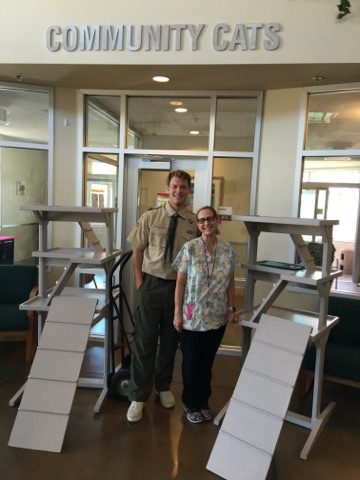

# Animal Shelter Cat Trees

### Eagle Scout Project
##### March 2016 - May 2016
BSA, Eagle Scout and Troop Leader, Temecula, CA
Organized the construction of two “cat trees” for a local animal shelter from donated and fundraised materials 
Led a troop of 13 scouts  
Time stamp

For my eagle scout project, I designed and led the construction of “cat trees” for a local animal shelter. These help with something, I led people, I contaced the people, I got kids to build stuff for kittens. Its a pretty neat time all aroudn

